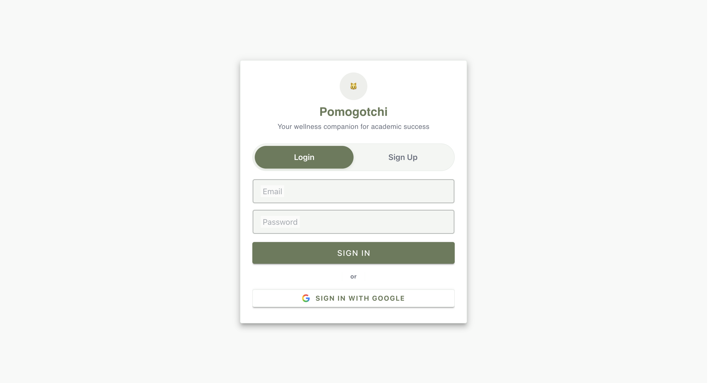
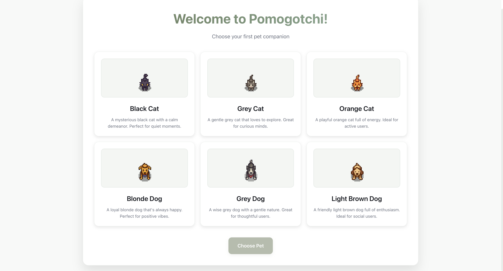
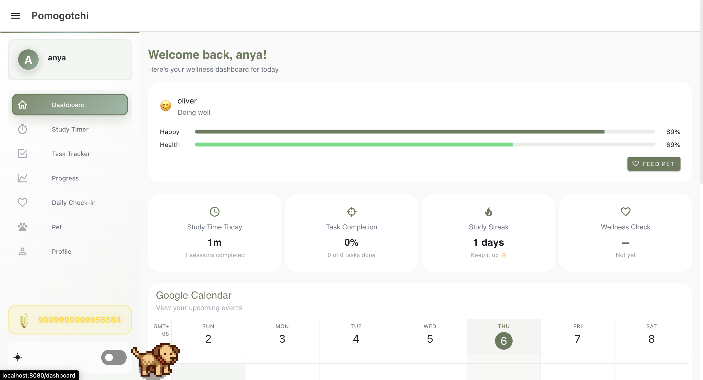
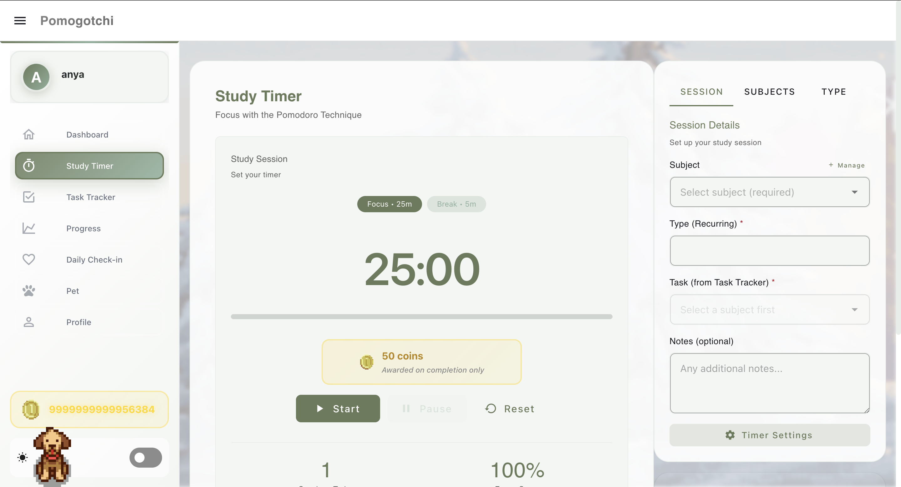
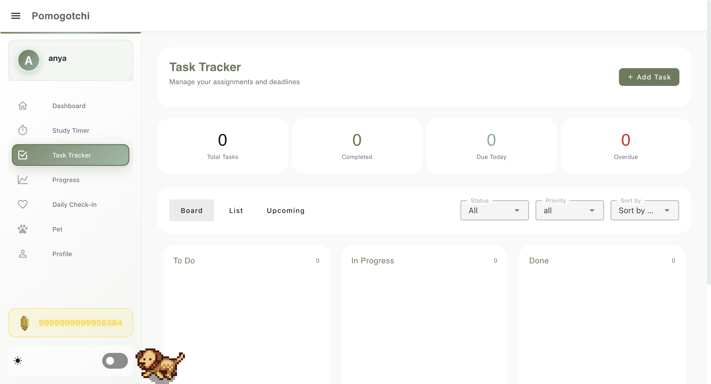
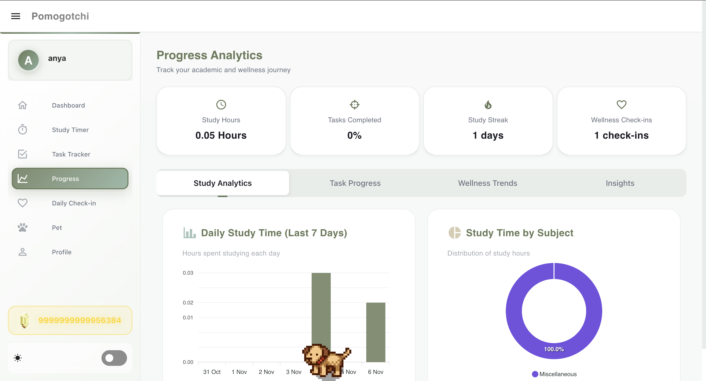
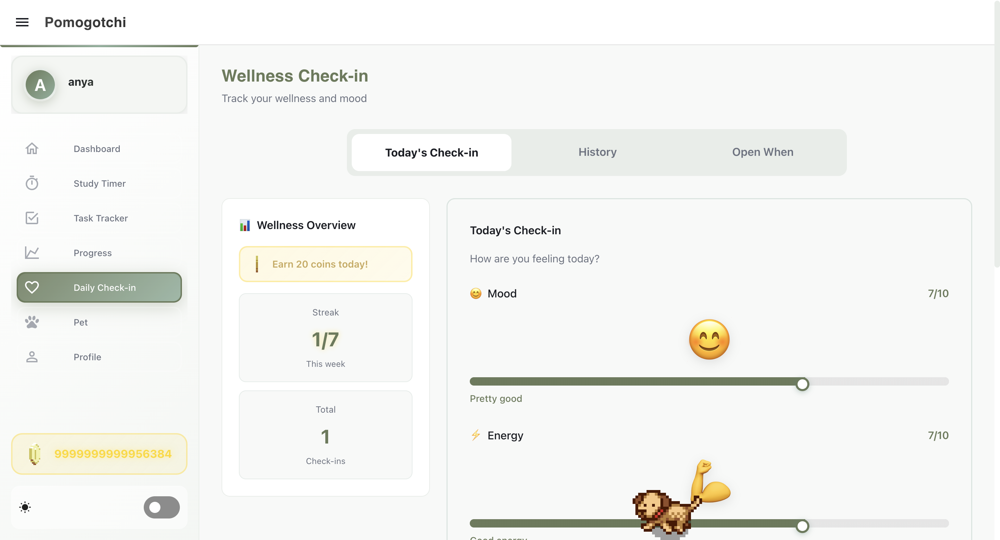
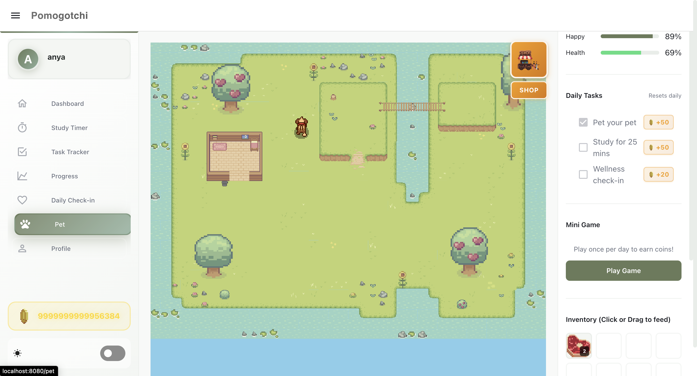
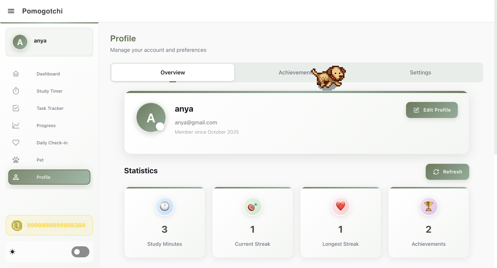

#  IS216 Web Application Development II

---

G3 Group 7 

---

## Group Members

| Photo | Full Name | Role / Features Responsible For |
|:--:|:--|:--|
|  | Anya Dharsan | Frontend + Backend Developer - Dashboard, Sidebar, Pet Selection, Responsiveness of pages|
|  | Joash Lau| Frontend + Backend Developer - API endpoints |
|  | Ethan Ng| Frontend + Backend Developer - Layout & Color Themes |
|  | Darren Neo Ming Zhou| Frontend + Backend Developer - Firebase Integration |
|  | Sandra Yap Kah Xin| Frontend + Backend Developer - API endpoints |
|  | Venice Hoe  | Frontend + Backend Developer - Layout & Color Themes |
|  | Joe Ye Di| Frontend + Backend Developer - Firebase Integration |
> Place all headshot thumbnails in the `/photos` folder (JPEG or PNG).

---

## Business Problem

Describe the **real-world business or community problem** your project addresses.

>Many students struggle to maintain a healthy balance between productivity and personal well-being. Existing apps often focus on only one aspect, >for instance, time management or mindfulness, without addressing how these areas intersect in daily student life. As a result, students  >experience burnout, poor mental health, and difficulty sustaining motivation. Our project tackles this gap by providing an integrated solution >that combines academic productivity with emotional wellness. By incorporating interactive and gamified features, it encourages consistency, >intentional resta and key challenges students face in managing both their performance and well-being.
---

## Web Solution Overview

### �� Intended Users
Primary: Students (secondary school, university, and postgraduate levels)
Secondary: Working adults seeking better work-life balance and study/wellness habits

### �� What Users Can Do & Benefits
Explain the core features and the benefit each provides.  

| Feature | Description | User Benefit |
|:--|:--|:--|

| Virtual Pet Wellness Companion | Tamagotchi-style virtual pet that evolves and thrives based on the user’s wellness and study habits | Builds emotional connection, promoting consistent engagement and self-care
| Enhanced Study Timer System | Pomodoro-based study timer with microbreak reminders for stretching, hydration, and eye rest	| Improves focus and prevents burnout through structured study-rest cycles
| Study Session Analytics & Productivity Insights | Tracks session data (task, subject, hours, progress, etc.) and generates productivity trends and completion insights | Helps users identify strengths, manage time effectively, and improve study performance
| Assignment Progress Tracker (Calendar View) | To-do list integrated into a calendar for organising assignments and reflecting on progress | 	Enhances time management and accountability for ongoing tasks
| Virtual Pet Gamification | Links study consistency and wellness habits to the pet’s well-being as you earn coins for your pet |	Encourages positive reinforcement and motivation through gamification
| User Profile & Login System | Personalised account setup and secure data storage	| Ensures data privacy while enabling personalized recommendations

---

## Tech Stack

| Logo | Technology | Purpose / Usage |
|:--:|:--|:--|
|  | **HTML5** | Structure and content |
|  | **CSS3 / Bootstrap** | Styling and responsiveness |
|  | **JavaScript (ES6)** | Client-side logic and interactivity |
|  | **Vite** | Development server and build tool |
|  | **Vue.js 3** | Component-based frontend framework |
|  | **Firebase** | Authentication and database services |
|  | **Python** | Backend |
|  | **FastAPI** | API Framework |
|  | **Google OAuth 2.0** | OAuth for user creation |
|  | **Google Calendar** | Google Calendar integration |
|  | **Notification API** | Notification for Achievement |


---

## Use Case & User Journey

Provide screenshots and captions showing how users interact with your app.

1. **Login**  
     
   - Displays Login page without option to login or sign up.

2. **Pet Selection**  
     
   - Displays 6 options for pets to choose when you first join and you can name the pet.

3. **Dashboard**  
     
   - Displays overall stats and pet health as well as google calendar to show what you have on that day.

4. **Study Timer**  
     
   - Displays pomodoro timer for studying with the option to manage subjects.

5. **Task Tracker**  
     
   - Displays all tasks and allows user to add tasks.

6. **Progress**  
     
   - Displays analytics for the user based on time studied, tasks completed and wellness habits along with insights.

7. **Daily Check-in**  
     
   - Users can checkin how they feel and also read motivational messages.

8. **Pet**  
     
   - Shows pet area with a shop, daily tasks and food. Also has a pet game for the user.

9. **Profile**  
     
   - Shows achievements and profile settings with lifetime data.

> Save screenshots inside `/screenshots` with clear filenames.

---

## Developers Setup Guide

Comprehensive steps to help other developers or evaluators run and test your project.

---

### 0) Prerequisites
- [Git](https://git-scm.com/) v2.4+  
- [Node.js](https://nodejs.org/) v18+ and npm v9+  
- Access to backend or cloud services used (Firebase, MongoDB Atlas, AWS S3, etc.)

---

### 1) Download the Project
```bash
git clone https://github.com/<org-or-user>/<repo-name>.git
cd <repo-name>
npm install
```

---

### 2) Configure Environment Variables
Create a `.env` file in the root directory with the following structure:

```bash
VITE_API_URL=<your_backend_or_firebase_url>
VITE_FIREBASE_API_KEY=<your_firebase_api_key>
VITE_FIREBASE_AUTH_DOMAIN=<your_auth_domain>
VITE_FIREBASE_PROJECT_ID=<your_project_id>
VITE_FIREBASE_STORAGE_BUCKET=<your_storage_bucket>
VITE_FIREBASE_MESSAGING_SENDER_ID=<your_sender_id>
VITE_FIREBASE_APP_ID=<your_app_id>
```

> Never commit the `.env` file to your repository.  
> Instead, include a `.env.example` file with placeholder values.

---

### 3) Backend / Cloud Service Setup

#### Firebase
1. Go to [Firebase Console](https://console.firebase.google.com/)
2. Create a new project.
3. Enable the following:
   - **Authentication** → Email/Password sign-in
   - **Firestore Database** or **Realtime Database**
   - **Hosting (optional)** if you plan to deploy your web app
4. Copy the Firebase configuration into your `.env` file.

#### Optional: Express.js / MongoDB
If your app includes a backend:
1. Create a `/server` folder for backend code.
2. Inside `/server`, create a `.env` file with:
   ```bash
   MONGO_URI=<your_mongodb_connection_string>
   JWT_SECRET=<your_jwt_secret_key>
   ```
3. Start the backend:
   ```bash
   cd server
   npm install
   npm start
   ```

---

### 4) Run the Frontend
To start the development server:
```bash
npm run dev
```
The project will run on [http://localhost:8080](http://localhost:5173) by default.

To build and preview the production version:
```bash
npm run build
npm run preview
```

---

### 5) Testing the Application

#### Manual Testing
Perform the following checks before submission:

| Area | Test Description | Expected Outcome |
|:--|:--|:--|
| Authentication | Register, Login, Logout | User successfully signs in/out |
| CRUD Operations | Add, Edit, Delete data | Database updates correctly |
| Responsiveness | Test on mobile & desktop | Layout adjusts without distortion |
| Navigation | All menu links functional | Pages route correctly |
| Error Handling | Invalid inputs or missing data | User-friendly error messages displayed |

#### Automated Testing (Optional)
If applicable:
```bash
npm run test
```

---

### 6) Common Issues & Fixes

| Issue | Cause | Fix |
|:--|:--|:--|
| `Module not found` | Missing dependencies | Run `npm install` again |
| `Firebase: permission-denied` | Firestore security rules not set | Check rules under Firestore → Rules |
| `CORS policy error` | Backend not allowing requests | Enable your domain in CORS settings |
| `.env` variables undefined | Missing `VITE_` prefix | Rename variables to start with `VITE_` |
| `npm run dev` fails | Node version mismatch | Check Node version (`node -v` ≥ 18) |

---

## Group Reflection

Each member should contribute 2–3 sentences on their learning and project experience.

> **Example Template:**  
> - *Anya:* Learned how to build responsiven websites and backend integration along with game features and working with animations  
> - *Joash:* Gained experience connecting frontend and backend APIs.  
> - *Ethan:* Improved UI/UX design workflow and collaboration using Figma.  
> - *Darren:* Understood how Firebase Authentication and Firestore integrate with modern SPAs.  
> - *Sandra:* Gained experience connecting frontend and backend APIs.  
> - *Venice:* Improved UI/UX design workflow and collaboration using Figma.  
> - *Joe:* Understood how Firebase Authentication and Firestore integrate with modern SPAs.  

As a team, reflect on:
- Key takeaways from working with real-world frameworks  
- Challenges faced and how they were resolved  
- Insights on teamwork, project management, and problem-solving  